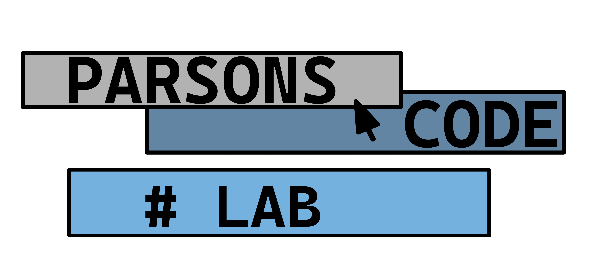

[](https://github.com/UH-Parsons-Project/faded-parsons-static/actions/workflows/main.yml)

[](https://codecov.io/gh/UH-Parsons-Project/parsons-code-lab)

# Python Faded Parsons Problems

Check it out here:

https://parsonscodelab.web.helsinki.fi

## Running the website

### To run locally:

```
docker compose --profile web up --build
```

The website can be accessed at http://localhost:8000/.

### Run all tests at once:

Run Pytest unittests and Playwright E2E-tests simultaneously.

```
./scripts/run-all-tests.sh
```

## Database migrations

This project uses Alembic for schema migrations.

### Developer workflow

1. Update SQLAlchemy models in `backend/models.py`.
2. Generate a migration:

```bash
docker compose exec -w /usr/src/app web alembic revision --autogenerate -m "describe change"
```

3. Review the generated file under `alembic/versions/`.
4. Apply migrations locally:

```bash
docker compose exec -w /usr/src/app web alembic upgrade head
```

5. Commit both model changes and migration file.

### OpenShift-native automatic migrations

In staging and production, each new pod runs Alembic migrations before the app starts.

- `manifest/staging/deployment.yaml`
- `manifest/production/deployment.yaml`

Container startup command:

```bash
alembic upgrade head && uvicorn backend.main:app --host 0.0.0.0 --port 8000
```

## Project Wiki
https://github.com/UH-Parsons-Project/parsons-code-lab/wiki

## Definition of Done

Code is validated and all tests are passing, docstrings are written, code is reviewed and approved by a peer developer before merging to the main branch, and the feature is successfully deployed to the production environment.

## Product and Sprint Backlogs
[Product Backlog](https://github.com/orgs/UH-Parsons-Project/projects/12)

## Original codebase

This codebase is based on the Faded Parsons Problems project found here: https://github.com/pamelafox/faded-parsons-static, which is licensed under the MIT License.
The original project, a static website, allows the user to run Faded Parsons Problems in the browser. It used Pyodide for executing Python doctests and localStorage for storing user progress. The original project contained the functionality for solving and submitting faded parsons problems which were then automatically tested according to task definitions.

The repository was forked in Jan 2026, and this fork was renamed and detached in Feb 2026.

## Team
Students:
- Julia Roukala
- Sebastian Olander
- Mira Tihveräinen
- Boris Versonnen
- Vili Mähönen
- Victoria Khoreva
- Santeri Silvennoinen

Instructor:
- Sasu Paukku

## Internal team communication 
- Telegram
- Discord
- Meeting up on campus

## Logo

Project logo made by [Victoria Khoreva](https://www.instagram.com/victheliar/):

test